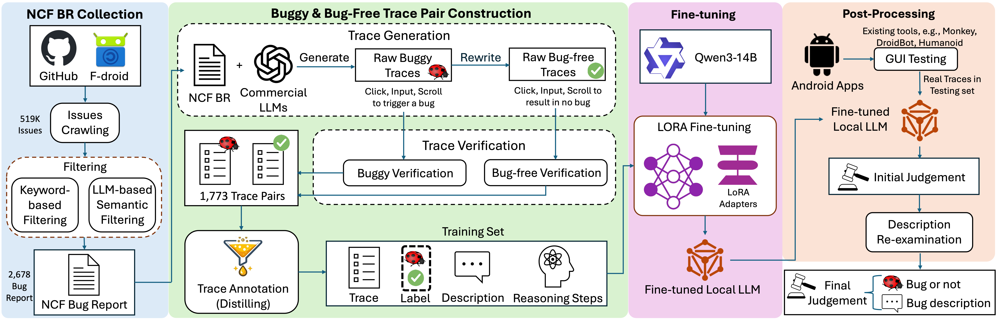

# FineDroid

FineDroid is an autonomous framework for detecting non-crash functional (NCF) bugs in Android applications. It adapts a locally deployable Qwen3-14B model to judge GUI testing traces, distills reasoning from commercial LLMs during training, and re-examines detected bugs to reduce false alarms.

On real-world testing sequences, FineDroid improves the NCF bug detection rate of local LLMs from 38% to 58% while reducing the false-alarm rate to 10%. Local inference also reduces dependence on commercial services and limits privacy exposure during deployment.



## Artifact workflow

1. [Web crawling](Web_crawling/readme) collects Android repository links and GitHub issues.
2. [NCF bug-report filtering](NCF_bug_report_filtering/readme.md) selects likely NCF bug reports.
3. [Training-data generation](Training_Data_generation/readme.md) constructs and verifies buggy/bug-free trace pairs.
4. [Fine-tuning and post-processing](Finetune%20and%20Post-processing/readme.md) trains the Qwen3-14B LoRA adapter and runs FineDroid.
5. [Evaluation](Evaluation/readme.md) contains predictions, labels, baseline comparisons, and the table-reproduction script.

## Large artifacts

Large files are stored in the [FineDroid Project Data folder on Google Drive](https://drive.google.com/drive/folders/1Gcd3DOvtz2brau-ETGziX9KAn1119fgM?usp=sharing).

| Archive | Related module | Contents |
|---|---|---|
| `all_issues_new.zip` | Web crawling and filtering | Complete set of crawled GitHub issues |
| `fine-tuned_qwen3-14b.zip` | Fine-tuning | FineDroid's Qwen3-14B LoRA adapter/checkpoint |
| `testingset.zip` | Fine-tuning and evaluation | Complete test-set APKs, screenshots, XML hierarchies, and traces |
| `detector_images.zip` | Evaluation | VisionDroid detector images |

## Reproducing the reported tables

```bash
python3 Evaluation/reproduce_tables.py --check
```

This command uses only Python's standard library and verifies the released case-level labels against the reported results.
